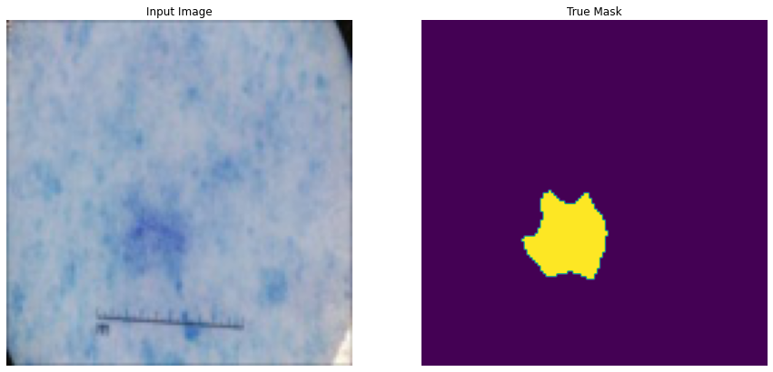
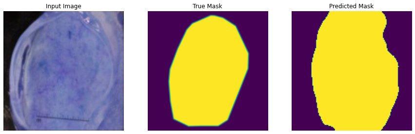
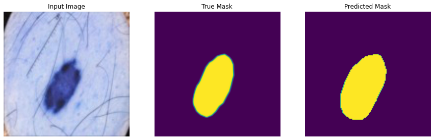
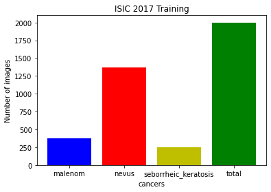
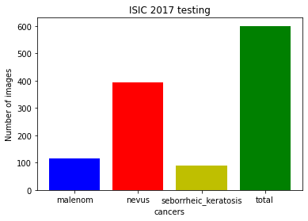

# ISIC_challenge_2017
Currently over 132,000 melanoma skin cancers occur globally each year,The diagnosis via visual inspection by patients and dermatologists is accurate only about 60 percent of the time.
Moreover, the shortage of dermatologists per capita has abetted the need for computer-aided methods to detect skin cancer.
The [ISIC 2017](https://challenge.isic-archive.com/data) dataset is an aggregation of a large amount of publicly accessible dermoscopy images labeled with ground truth data.

**The ISIC 2017 challenge was divided into 3 tasks:**
* Task 01: Lesion segmentation
* task 02 : Lesion Attribute Detection
* Task 03 : Disease Classification

I worked on Task1 and task3 ,i.e segmentation and classification of images into one of 3 possible classes

# Task 01: Lesion segmentation

For the training I worked with 2000 dermoscopic images and there corresponding Ground-Truth mask from ISIC data set.
For the testing 600 images with the corresponding Ground-Truth
I resized the images to (128,128) for faster processing. 

* Using U_net Model to do the task with Dice coefficient 
 result

# Task 03: Disease Classification
For the training I worked with 2000 dermoscopic images and there corresponding Ground-Truth CSV file from ISIC data set.
For the testing 600 images with the corresponding Ground-Truth CSV file.

